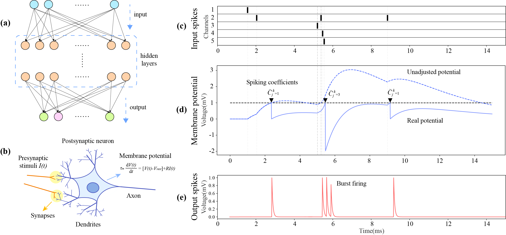
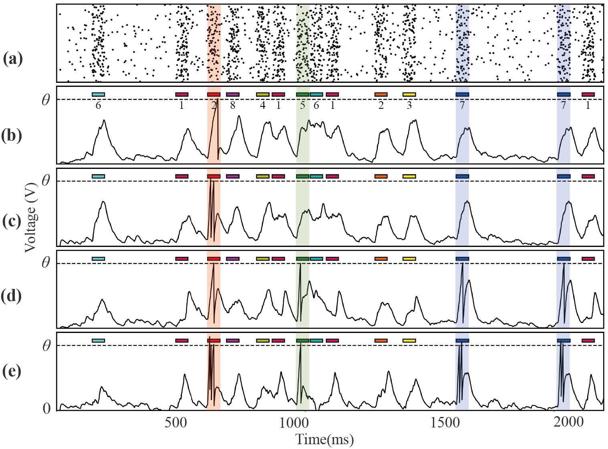

# Synchronized Membrane Potential-driven Plasticity for Spiking Neural Networks

This is the official code repository for the paper: Synchronized Membrane Potential-driven Plasticity for Spiking Neural Networks.

In our paper, we introduce:

- **A temporally encoded spiking neural network based learning sysem:** The multilayer SNN with a fully connected structure. The LIF neuron is employed as the basic unit of computation in the SNN.

- **A novel synchronized membrane potential-driven plasticity (SMDP) algorithm:** Inspired by biological burst-firing phenomena, SMDP assigns spiking coefficients to each spike event, allowing neurons to emit multiple spikes simultaneously.

